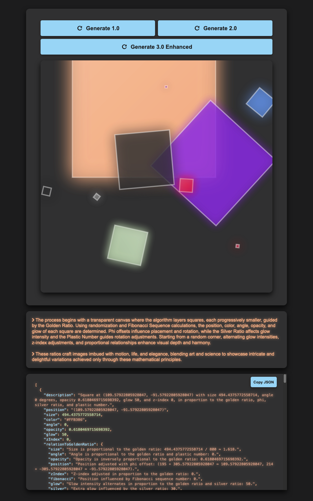

# phiSquares

Explore the aesthetically pleasing placement and orientation of squares using the Golden Ratio, Phi, and the Fibonacci Sequence. Available on [Opensea](https://opensea.io/collection/phisquares). 

